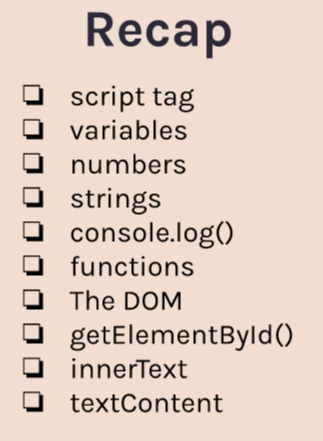

<h1 align="center">passengerCounter</h1>

<h4 align="center">
    simple counter that increment and save prev count .
</h4>

  <h3>
    <a href="https://muhmmadawd.github.io/passengerCounter/">
      Live Demo
    </a>
  </h3>

<!-- TABLE OF CONTENTS -->

## Table of Contents

- [Overview](#overview)
- [Built With](#built-with)
- [Features](#features)
- [Contact](#contact)

<!-- OVERVIEW -->

## Overview

<!-- Introduce your projects by taking a screenshot or a gif. Try to tell visitors a
story about your project by answering: -->

<!-- - Where can I see your demo?
- What was your experience?
- What have you learned/improved?
- Your wisdom? :) -->

##### want I learned

### Built With

<!-- This section should list any major frameworks that you built your project using. Here are a few examples.-->

- html/css
- js
- my muscles 😉

## Features

<!-- List the features of your application or follow the template. Don't share the figma file here :) -->

- Responsive layout that adjusts to different screen sizes
- simple counter that increment and save prev count .

##Fork You can also clone the repo and modify the code to create your own
version of the website.

## Contact

<h5> If you have any questions or feedback, please feel free to contact me at
<a href="mailto:muhmmad.awd@gmail.com">muhmmad.awd@gmail.com</a>
</h5>

  <h5>
    <a href="https://www.linkedin.com/in/muhmmadawd/">
      linkedin - muhmmadawd
    </a>
  </h5>

  <h5>
    <a href="https://github.com/MuhmmadAwd/">
      GitHub - muhmmadawd
    </a>
  </h5>

